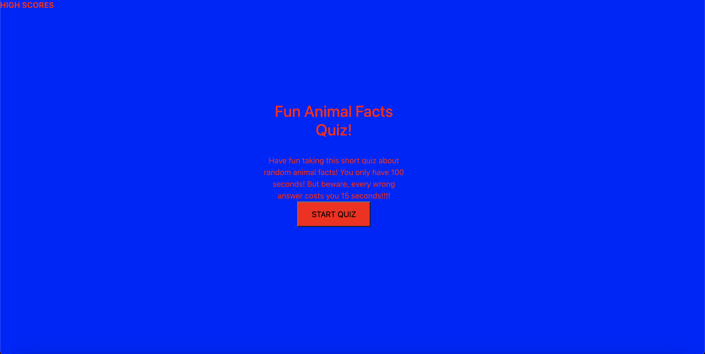
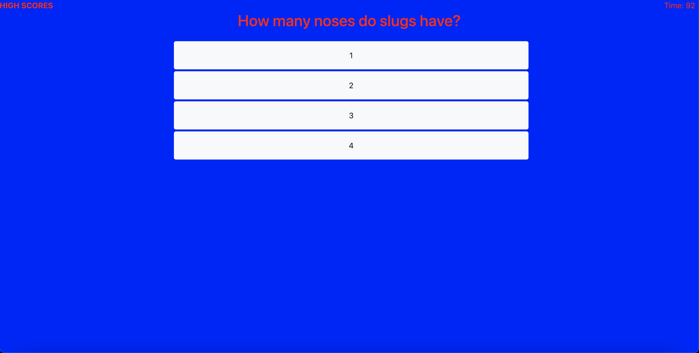

# Code_Quiz
Gives the user a quiz on 10 random animal facts. After finishing the quiz, the user would be able to log in their score and it would be added to the leader board. 
## Deployed Link
[Code_Quiz](https://jpls218.github.io/Code_Quiz/). 

## Screenshots
Below is a screen shot of the opening page and a question example:

