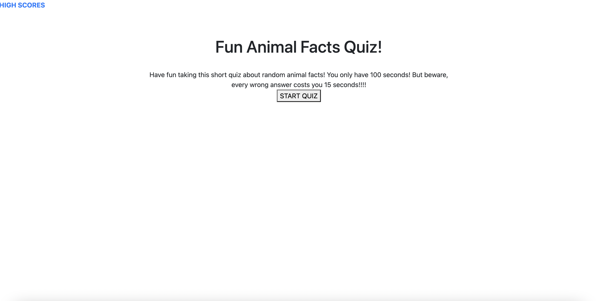
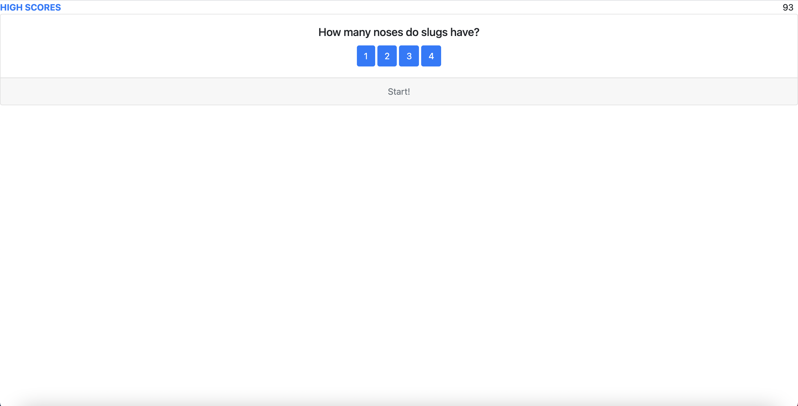

# Code_Quiz
Gives the user a quiz on 10 random animal facts. After finishing the quiz, the user would be able to log in their score and it would be added to the leader board. I struggled getting my scoreboard to work. Overall, this project was hard for me to complete and may be lacking in some areas. A link to the website can be found at [https://jpls218.github.io/Code_Quiz/]. Below is a screen shot of the opening page and a question example:

